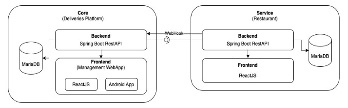

<h1 align="center">
SendASnack
</h1>

## Abstract
Our application is an online food ordering and delivery platform named “SendASnack”. While the scope of the deliveries platform will remain as general as possible, the client side application will be specific to a fast food restaurant. 

## Team Members
- [Pedro Monteiro](https://github.com/pedromonteiro01)
    - DevOps Master
- [Eduardo Fernandes](https://github.com/rezeett)
    - Team Coordinator
- [Hugo Gonçalves](https://github.com/Hugo1307)
    - QA Engineer
- [Daniela Dias](https://github.com/Danielar0w0)
    - Product Owner

## Architecture

  

## Deployment

Our services are deployed in the Azure Web Services in the following addresses:

### Core

* **Backend**: 20.77.90.223:8080 
* **Frontend**: 20.77.90.223:3000

### Service

* **Backend**: 20.77.90.223:8081
* **Frontend**: 20.77.90.223:3001

## Documents

All the created documents and reports are available in the directory "documents".

## Technologies Used

&nbsp;
&nbsp;
&nbsp;
&nbsp;

